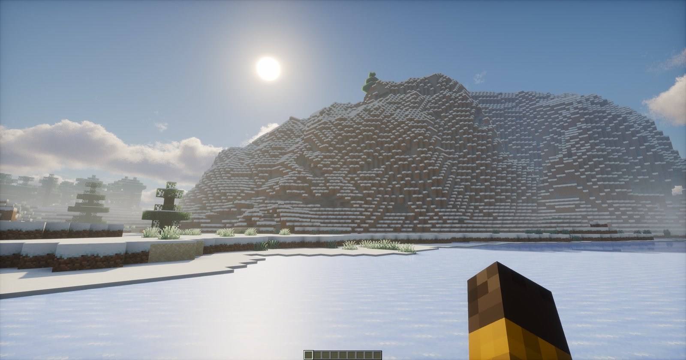

<h1 align="center">Photon Shaders for Mac</h1>

<b>An unofficial version of <a href="https://github.com/sixthsurge/photon">Photon</a> that works on Apple Silicon Macs (M1, M2, M3, M4).</b>

The normal Photon doesn't load on Macs: you get "the shaderpack failed to load" or a black screen. This version fixes that and looks the same.

## Download

**[Download Photon for Mac (zip)](https://github.com/jspaterson000/photon/releases/latest)**

## Install

1. Install [Iris](https://irisshaders.dev/download) (with Sodium).
2. In Minecraft go to **Options → Video Settings → Shader Packs → Open Shader Pack Folder**.
3. Drop the zip into that folder. Don't unzip it.
4. Pick **Photon-Mac** in the list and click **Apply**.

Works with Iris 1.7.6 (Minecraft 1.20.1) and newer. About 50 fps on High on an M4 Pro. For more fps, turn on **TAAU** under Post-processing.

## Known issues

- **Black screen with the Point Blank (guns) mod:** open `config/pointblank-common.toml` and set `advancedIrisIntegrationEnabled = false`.
- **Distant Horizons** isn't supported on Mac yet.
- **Colored Lights** are turned off, because Macs can't run them.

Found a problem? [Open an issue](https://github.com/jspaterson000/photon/issues).

This is a fork. All credit for Photon goes to [SixthSurge](https://github.com/sixthsurge). The Mac changes are proposed upstream in [#670](https://github.com/sixthsurge/photon/pull/670). Please don't report Mac problems to the original project.

---

  

<h1 align = "center">Photon Shaders</h1>

A gameplay-focused shader pack for Minecraft

## Acknowledgments

* Menu translations: 
  * [NakiriRuri](https://github.com/NakiriRuri) and [OrzMiku](https://github.com/Orzmiku) - Chinese Simplified (China; Mandarin)
  * [ChunghwaMC](https://github.com/ChunghwaMC) - Chinese Traditional (Taiwan; Mandarin)
  * [Jmayk](https://github.com/Jmayk-dev) - Italian
  * [Timtaran](https://github.com/Timtaran) - Russian
  * [shihyeon](https://github.com/shihyeon) - Korean
  * [DVRKHz](https://github.com/DVRKHz) - Spanish
  * [Patatagod69](https://github.com/PatataNL) - Dutch
  * sincerity - Estonian
* [Emin](https://github.com/EminGT) - Shadow bias method from [Complementary Reimagined](https://www.complementary.dev/shaders/) (fully fixes peter panning and light leaking underground!)
* [DrDesten](https://github.com/DrDesten) - Depth tolerance calculation for SSR (helps to prevent false reflections)
* [Essentuan](https://github.com/Essentuan) - Photonics mod support
* [Jessie](https://github.com/Jessie-LC) - f0 and f82 values for labPBR hardcoded metals
* [Sledgehammer Games](https://www.sledgehammergames.com/) - Bloom downsampling method used in Call of Duty Advanced Warfare (described [here](http://www.iryoku.com/next-generation-post-processing-in-call-of-duty-advanced-warfare))
* http://momentsingrapics.de/ - Blue noise texture
* [NASA Scientific Visualization Studio](https://svs.gsfc.nasa.gov/4851) - Galaxy image

## Installation

* Photon can be used with [Iris](https://irisshaders.dev/download) (recommended) or [OptiFine](https://optifine.net/home)
* Iris is a modern shader loader with far better performance, mod compatibility and developer features than OptiFine. Some features (Colored Lighting) will only work on Iris
* Once you have your preferred shader loader installed, simply place the downloaded zip file in your `.minecraft/shaderpacks` folder

### Downloads
* [Releases](https://modrinth.com/shader/photon-shader/versions) (recommended)
* [Lastest commit](https://github.com/sixthsurge/photon/archive/refs/heads/main.zip)

## Features
* Fully revamped sky, lighting and water 
* Detailed clouds with many layers and cloud types
* Immersive weather system providing different skies each day
* Voxel-based colored lighting (enabled with Ultra profile, requires Iris)
* Screen-space reflections
* Volumetric fog
* Soft shadows with variable-size penumbras
* Detailed ambient occlusion (GTAO)
* Camera effects: bloom, depth of field, motion blur
* Much improved image quality with TAA, FXAA and CAS
* Advanced temporal upscaling (disabled by default) for low end devices
* Extensive settings menu allowing you to customize every aspect of the shader
* Full labPBR resource pack support

## Compatibility
### GPU vendors
* Nvidia 
* AMD 
* Intel 
* **_NOT_** Apple Metal
  * You may be able to get the shader pack to work by disabling some settings: try _SH Skylight_ and _Colored Shadows_.
### Shader loaders
* Iris - version 1.5 and above
* OptiFine - on Minecraft 1.16.5 and above
### Special mod support
* [Distant Horizons](https://www.curseforge.com/minecraft/mc-mods/distant-horizons)
* [Voxy](https://modrinth.com/mod/voxy)
* [Photonics](https://modrinth.com/mod/photonics)

## Showcase videos

	
	
 by iambeen
	  

	
	
 by CosmicNexus
	  

	
	
 by VIPUL
	  

## Community

- For questions, suggestions and news regarding this shader pack, head to my [discord server](https://discord.gg/ngEW66HScd)
- You can also [give me money](https://ko-fi.com/sixthsurge) if you want to 
